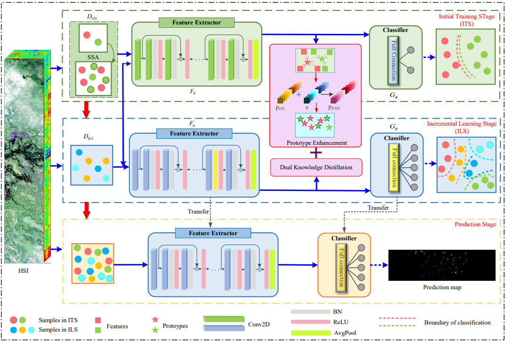

# DCPRN: Distillation-Constrained Prototype Representation Network for Hyperspectral Image Incremental Classification

This repository is the official implementation of [DCPRN: Distillation-Constrained Prototype Representation Network for Hyperspectral Image Incremental Classification](https://ieeexplore.ieee.org/document/10416249). 

<p align='center'>
  
</p>
### Abstract

Oriented to adaptive recognition of the new land-cover categories, incremental classification (IC) that aims to complete adaptive classification with continuous learning is urgent and crucial for hyperspectral image classification (HSIC). Nevertheless, deep-learning-based HSIC models adopted the learning paradigm with fixed classes yield unsatisfactory inference in the situation of IC due to the catastrophic forgetting problem. To eliminate the recognition gap and maintain the old knowledge during IC, in this paper, we propose a novel approach called the distillation-constrained prototype representation network (DCPRN) for hyperspectral image incremental classification (HSIIC). The primary goal of DCPRN is to enhance the discriminative capability for recognizing the original classes in HSIIC, while effectively integrating both the original and incremental knowledge to facilitate adaptive learning. Specifically, the proposed framework incorporates a prototype representation mechanism, which serves as a bridge for knowledge transfer and integration between the initial and incremental learning phases of HSIIC. Additionally, we present a dual knowledge distillation module in incremental learning, which integrates discriminative information at both the feature and decision level. In this way, the proposed mechanism enables flexible and dynamic adaptation to new classes and overcomes the limitations of fixed-category feature learning. Extensive experimental analysis conducted on three popular data sets validates the superiority of the proposed DCPRN method compared with other typical HSIIC approaches.

### Platform

This code was developed and tested with pytorch version 1.12.1

### Setting

First you need to download a Botswana, Houston, Salinas dataset and put it in the Dataset folder.

Then all data sets are sliced 9×9 to generate pre-processed intermediate files and placed in the Data folder and modify line 44,46 of the model.py file and line 12 of the Test.py file.

This code gives you a Houston data set run by default where you may want to modify the parameters to suit the data set.

### Train

```
$ python Train.py
```

### Test

```
$ python Test.py
```


### Result

You can view the saved model in the model_saved_check folder. View the test results in result.txt. y_pre_houston_9.mat file was drawn to realize the visualization of hyperspectral image prediction results.

You can find our original paper at the link below.
[DCPRN: Distillation-Constrained Prototype Representation Network for Hyperspectral Image Incremental Classification](https://ieeexplore.ieee.org/document/10416249). 
